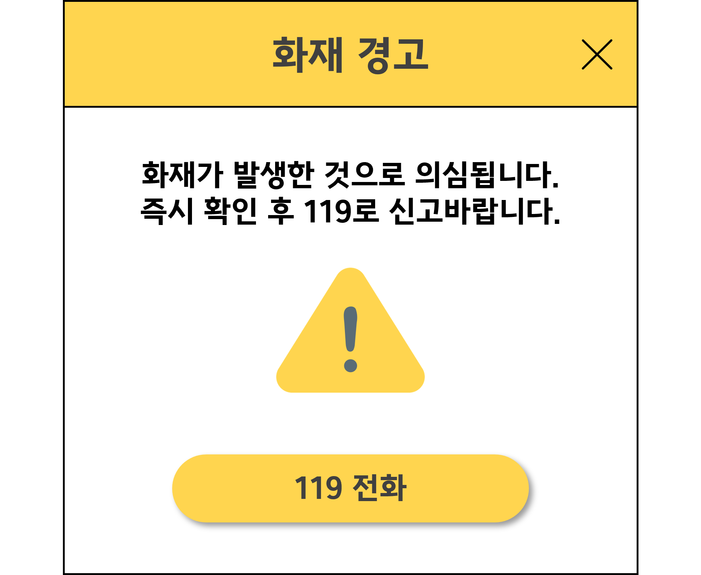
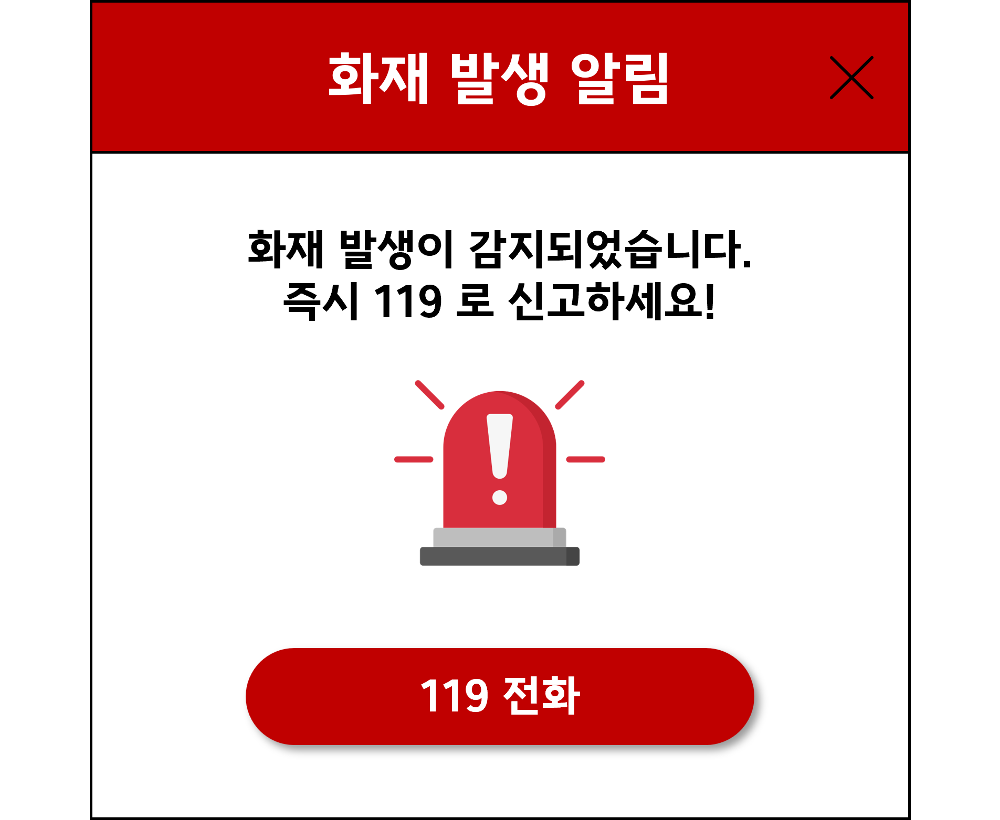

# 프로젝트 개요

* 화재를 감지하는 사람이 부재할 경우 발생하는 화재를 AI가 감지하여 화재를 알리는 서비스 
* Ultralytics의 YOLOv5모델을 사용하여 AI로 실시간 화재를 감지하는 서비스 
* 기존의 화재감지기의 문제점을 보완하기 위해 기획한 실시간으로 영상 내 화재와 연기 Object를 Detection
* 프로그램 실행을 위해 exe 파일로 제작

 

## 👩‍💻팀 인원 및 역할

* 총 5명의 팀원
* 최종 프로젝트에 채택할 모델을 테스트하기 위해 YOLOv8와 YOLOv5 테스트 모델 구현
* 이미지 데이터셋 추가 구축(화재로 인한 연기, 화재 불꽃)
* YOLO 라벨링 변환과 같은 데이터 전처리
 

## 📌 사용 데이터
* [AI Hub 화재 영상 데이터셋](https://www.aihub.or.kr/aihubdata/data/view.do?currMenu=&topMenu=&aihubDataSe=realm&dataSetSn=176)
* 구글 화재 이미지 데이터
* 데이터 라벨링 Tool: [RoboFlow](https://roboflow.com/)
 

  
# 🔥 Skills

## AI

  &nbsp;&nbsp;
  &nbsp;&nbsp;
  

## Front-End

  

## Tools

  &nbsp;&nbsp;
  &nbsp;&nbsp;
  &nbsp;&nbsp;

# 사용 방법

1. [다운로드 클릭](https://drive.google.com/file/d/14ObT1cmKxJP_9W_44OrceHMYzoIo8ZU-/view?usp=drive_link) 후 폴더안의 run.zip 압축을 해제하여
2. 그 안의 run.exe 파일을 실행한다.
3. 원하는 영역만큼  왼쪽 위에서 오른쪽 아래로 드래그 하여 cctv화면(동영상의 화면)의 크기에 맞춰주고
4. 테스트 해볼 영상을 재생하거나 띄워준다.

# 미리보기

 

## 화재 의심이 될때  경고문

## 화재 발생시 경고문

* [발표자료 바로가기](https://github.com/KoYesung/Portfolio_Fire/files/12513703/_.pdf)
